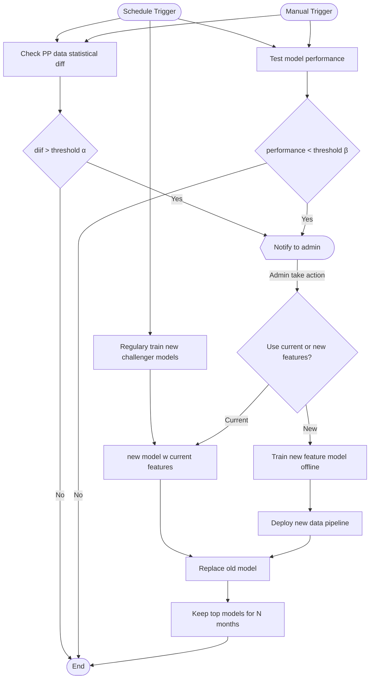
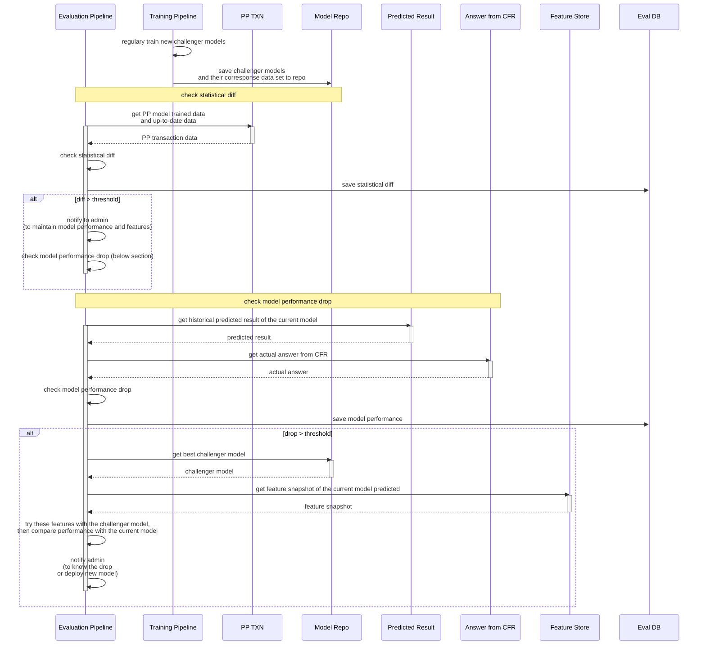

# Model Evaluation Pipeline
PromptGuard is designed to self maintaining in term of model performance.
It will periodically evaluate and update prediction models.

We can evaluate both model performance and how much users follow our score suggestion (trust the score).
To evaluate how user trust our scores, we can use high risk score PromptPay proxy lookup vs credit transfer transaction. If they believe the score, there will be less credit transfer transaction than the lookup.

But later on in this doc, we will focus on how to evaluate the model performance.

## Conceptual flow
Below is a conceptual flow of the model evaluation pipeline and performance maintainance.

**Design principles:**  
- For the current features used, the model will be shadowing regulary trained. To make sure, we always have a better model standing by.
- The model retention period or number can be configurable, to make sure, we can recover from a previous model version, if needed.
- All change decisions are made by human.

**Note that:** Any feature change will impact both model and feature preparation.

## Flows
Here we show the sequential diagrams of the evaluation pipeline:

> ⚠️ As of 2025, actual answer from CFR is delay around 21 days to complete for the *invesment fraud* cases, and 3 days for others.

## Apache Airflow pipelines
TODO detail of the Airflow

## Data Prep workers
These are data preparation workers saving data to SeaweedFS for evaluation pipeline.

- PromptPay Transaction Recorder. [Detail](../data-prep.md#promptpay-transaction-recorder)
- Predicted Score Capture. [Detail](../data-prep.md#predicted-score-capture)
- CFR Data Capture. [Detail](../data-prep.md#cfr-data-capture)