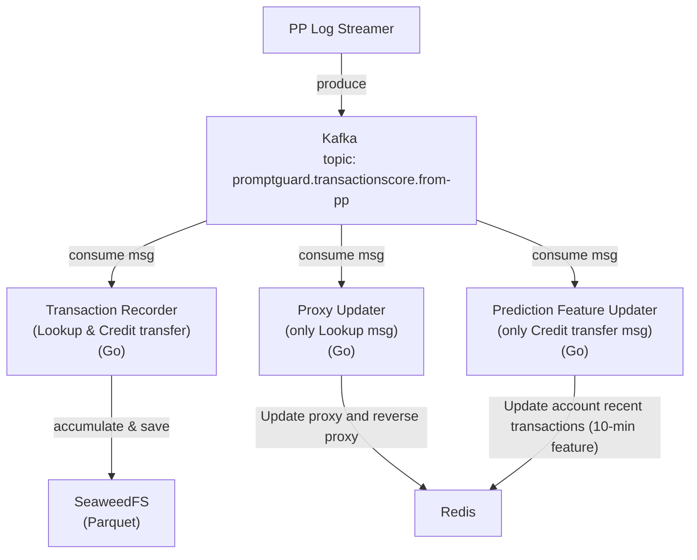
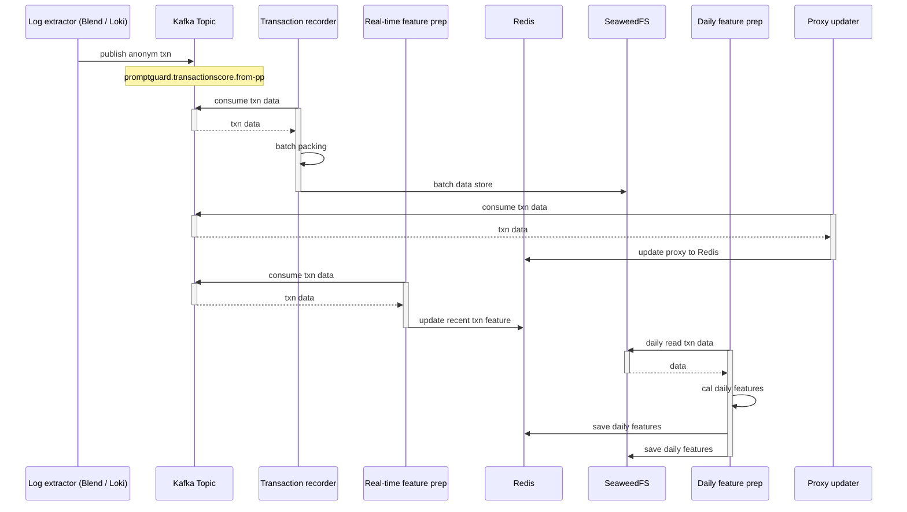
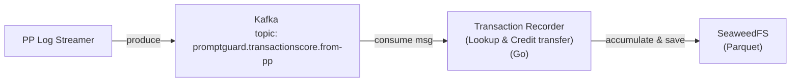
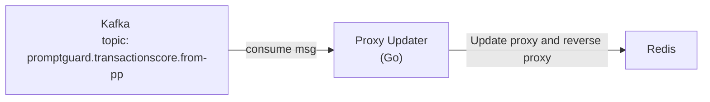
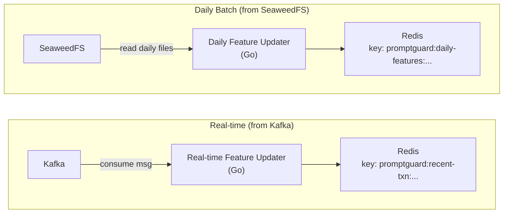
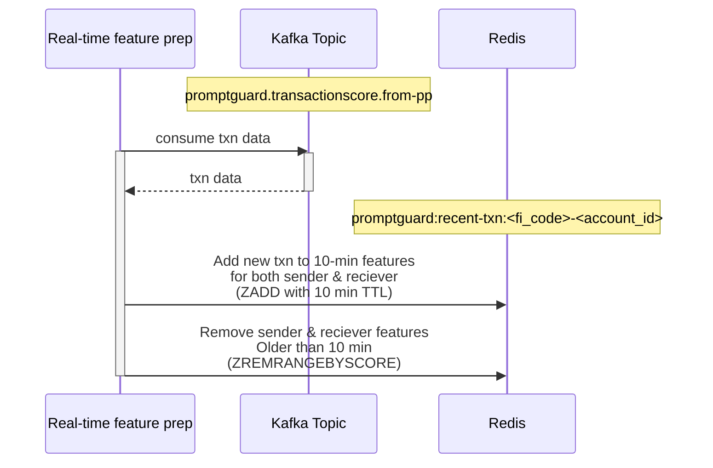
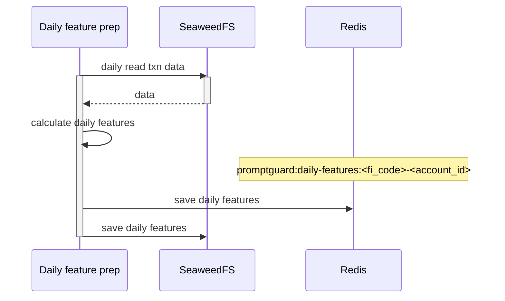
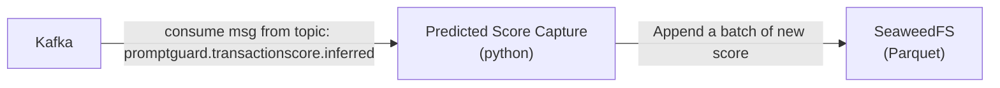
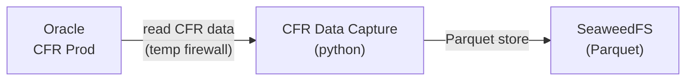

# Real-time Transaction Data Preparation
Real-time transaction data prep consumes message from the Kafka topic: `promptguard.transactionscore.from-pp`.  
There are 3 sub modules here:

1. Transaction recorder: to save transactions for using in daily feature preparation and evaluation pipeline (data profile shifing check)
1. Proxy Updater: to update bank account proxy id
1. Prediction feature preparation: to use in prediction pipeline



## Sequence Diagram


# PromptPay Transaction recorder
This module will consume the PromptPay transaction from `promptguard.transactionscore.from-pp` topic. It accommulates the transaction data then saves to SeaweedFS, in Parquet (Zstd) format.  



The transaction schema is defined here: [PromptPay message schema](./txn-risk-score/index.md#promptpay-message-schema).

These saved transactions will be used by [Daily Feature Preparation](#daily-aggregated-features), [Evaluation](./model-eval/index.md), and [Training](./model-train/index.md) pipelines.

# Proxy Updater
This module consumes the PromptPay transaction from `promptguard.transactionscore.from-pp` topic. It extracts proxy and actual account information, if any, then update to proxy mapper in Redis.



## Proxy mapper (Proxy to account mapping)
**Redis Key:** `promptguard:proxy-mapper:<proxy_id>`  
**Value:**
```json
{
  "fi_code": "014",
  "actual_account": "12e345g66f78a9b", // hashed
  "proxy_type": "mobile",
  "last_updated": 1735900000   // unix timestamp
}
``` 

Available proxy types: 

| Type | PromptPay Proxy Type | PromptGuard Proxy Type | Proxy Updater Action |
|--|--|--|--|
Actual Account | - | account | Ignore |
National ID | NATID | nat_id | Update to Redis. <br> Map `nat_id` with bank account. |
Mobile Number | MSISDN | mobile | Update to Redis. <br> Map `mobile` with bank account. |
Biller ID | BILLERID | biller_id | Update to Redis. <br> Map `biller_id` with bank account. |
E-Wallet | EWALLETID | wallet_id | Update to Redis. <br> The `actual_account` is `wallet_id`, <br> Ex. `wallet_id`: 1400917891000 means: <br> `actual_account` = 1400917891000 |
E-Mail | EMAIL | email | Update to Redis. <br> Curretly not existed in PP |


> ℹ️ NOTE
> * PromptPay proxy_id is originally global unique.  
> * Multiple E-Wallet users can have only one common bank account, except KBank QR receiving wallet. That's why, we do not aggregate the `wallet_id` into one translated bank account.
> * As per 2025 Nov, CFR has defined the `fi_code` for Thai e-wallet providers, as seen in [bank_info.csv](https://github.com/itmx-rnd/silo-101/blob/main/bank_info.csv).
>   * For any provider not listed there, we will use their TEPA code instead.

The Proxy Updater updates the proxy mapper to Redis for every transaction, except the actual account transaction. It does not “check then update” – just always overwrite, for the fastest strategy. It also update the reverse-lookup sets, to retreive all proxies of an account. 

## Reverse proxy mapper (Account to proxies mapping)
**Redis Key:** `promptguard:proxy-reverse:<fi_code>-<account_id>` 
> ℹ️ *account_id* is hashed to be matched with CFR data.

**Value:**
```json
[
  {
    "proxy_id": "0987654321",
    "proxy_type": "mobile"
  },
  {
    "proxy_id": "12345667891234",
    "proxy_type": "nat_id"
  }
]
``` 

Here are the relavant Redis commands:
```bash
# Add proxy mapping
SET promptguard:proxy-mapper:<proxy_id> <account_json>

# Add reverse proxy mapping in the set
SADD index:promptguard:proxy-reverse:<fi_code>-<account_id> <proxy_json>

# Remove a reverse proxy in the set
SREM index:promptguard:proxy-reverse:<fi_code>-<account_id> <proxy_json>

# Get all proxies of an account
SMEMBERS index:promptguard:proxy-reverse:<fi_code>-<account_id>
```

# Prediction Feature Updater
This module consumes PromptPay transactions from Kafka and SeaweedFS, then update prediction features to Redis. There are 2 sub-modules shown as below:



## Near Real-time Features
These prediction features are 10-min raw transaction data consumed from Kafka and cached on Redis.
   
**Key:** `promptguard:recent-txn:<fi_code>-<account_id>`  
> ℹ️ *account_id* is hashed to be matched with CFR data.

**Value:**
```json
[
  {
    "action": "send",
    "amount": 200,
    "timestamp": "2023-01-01T00:00:00+07:00",
    "counterparty_account_id": "<hash_of_account_b>",
    "counterparty_fi_code": "bank_b"
  },
  {
    "action": "receive",
    "amount": 550,
    "timestamp": "2024-01-01T00:00:00+07:00",
    "counterparty_account_id": "<hash_of_account_c>",
    "counterparty_fi_code": "bank_c"
  }
]
```
These features is kept with Redis ZADD (sorted set), sorting by unix timestamp (in seconds).
The transaction score Kafka consumer (worker) and API server will aggregate these prediction features before calling the Core Prediction Service.

### Sequence Diagram
This feature updater will comsume the PromptPay transaction from Kafka and add a new transaction to Redis. For each account, it must refresh 10-min TTL of the key and remove transaction records older than 10 minutes to maintain memory usage.



Here are the relavant Redis commands:
```bash
# Add transaction
ZADD promptguard:recent-txn:<fi_code>-<account_id> <timestamp> <json>

# set 10-min TTL
EXPIRE promptguard:recent-txn:<fi_code>-<account_id> 600

# Remove old ones (10+ min)
ZREMRANGEBYSCORE promptguard:recent-txn:<fi_code>-<account_id> -inf <now-600>

# Read recent ones (10- min)
ZRANGEBYSCORE promptguard:recent-txn:<fi_code>-<account_id> <now-600> +inf

# Read all
ZRANGE promptguard:recent-txn:<fi_code>-<account_id> 0 -1
```

## Daily aggregated features
     
**Key:** `promptguard:daily-features:<fi_code>-<account_id>`  
*account_id* is hashed to be matched with CFR data.

**Value:**
```json
{ 
    "f1": 150,
    "f2": 500,
    "f3": 30,
    ...
    "f300": 300.0
}
```
<!-- // TODO update features from Nicky   -->
These features will be daily processed from SeaweedFS, then kept in Redis.  
We can use GET and SET commands for Redis without expiration set.  
If the cache lost, we can retrieve them from SeaweedFS.

### Sequence Diagram


TODO: idempotent, prevent loss


# Scheduled Data Preparation

These are scheduled data prep for evaluation pipeline. It composes of:

- Predicted score capture
- CFR data capture
  

## Predicted Score Capture
This worker consumes score messages from Kafka topic: `promptguard.transactionscore.inferred`, then save to SeaweedFS for later used in model evaluation pipeline.



The worker use python for easily handle the data in paquete format. It will keep the predicted data in daily partitioned folder, splitted by an optimal size.  

The predicted data retention period is set to 13 months, for seasoning behavior understanding.
We can set the SeaweedFS bucket lifecycle via this s3 command:
```bash
aws --endpoint-url http://seaweedfs-s3-endpoint:8333 s3api put-bucket-lifecycle-configuration \
  --bucket my-bucket \
  --lifecycle-configuration '{
    "Rules": [
      {
        "ID": "DeleteOldData",
        "Prefix": "transactionscore_inferred/",
        "Status": "Enabled",
        "Expiration": { "Days": 397 }
      }
    ]
  }'
```

## CFR Data Capture
This worker will be scheduled pulling anonymous CFR data from Production. The firewall between the worker and CFR networks are separated, and will be opened as agreed with GRC team.

> ℹ️ As per 2025 Nov, we agreed to open it every 15 day for 3 hours.



Estimated size of CFR data: [SeaweedFS Sizing](./common-components/seaweed.md#base-estimation).

