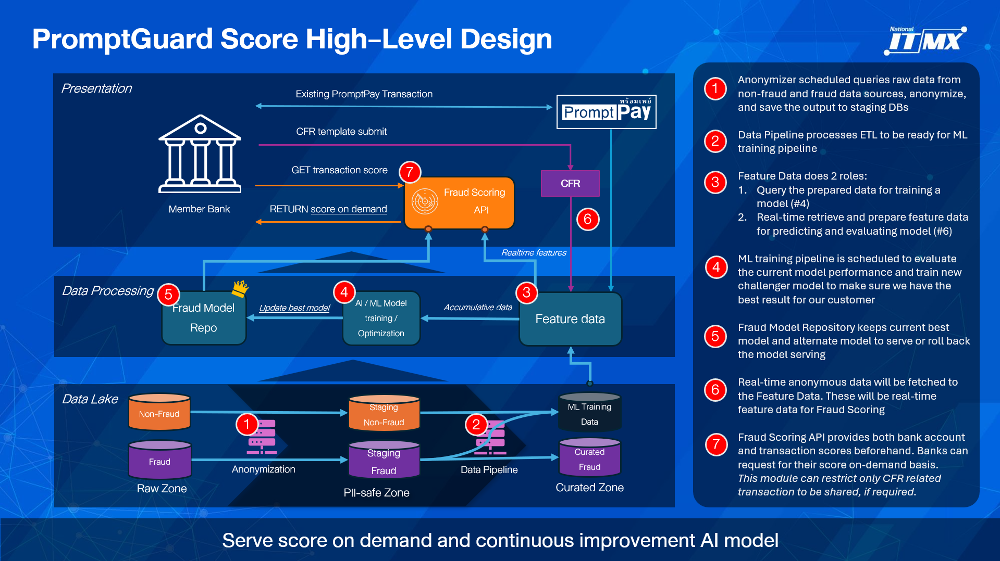
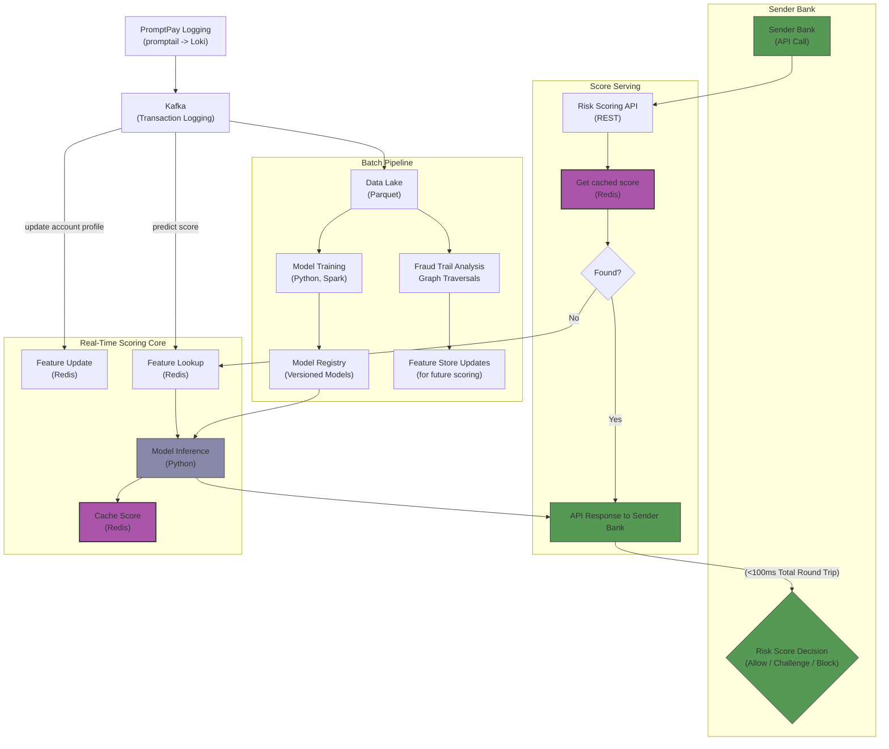
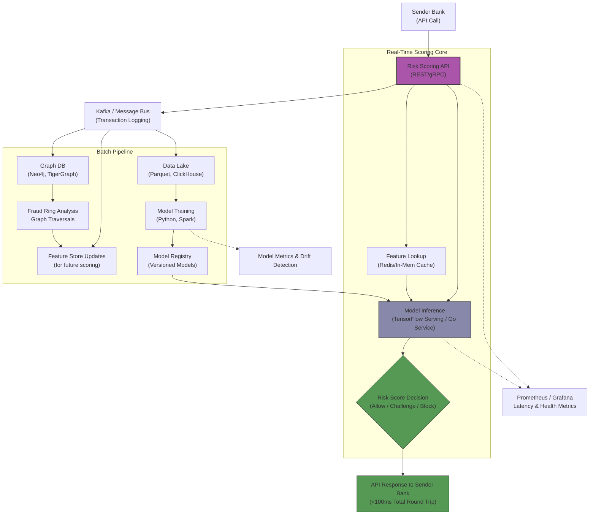

# High Level Design
This section will provide you broad vision of the system.

## C1 – Context

## C2 – Container Diagram
 

### High Level design

**Transaction Risk Score**

## C3 – Component Diagram
 

### List of Components

Later in this doc, we will provide more information of each component following:

1. Blendata PromptPay fetcher
2. Apigee API gateway
3. ITMX SSO integration
4. Jupyter Hub
5.  Transaction risk score service
    1. API service
    2. Core Prediction Service
    3. Redis feature store
    4. Kafka topic
    5. Real-time Transaction Data Preparation
    6. File Storage: Model Repo, Prediction Result Store
6.  Account risk score service
    1. API service
    2. Database & Data model
    3. Prediction Pipeline
    4. Redis feature
    5. File Storage: Master data, Model Repo, Prediction Result Store
7.  Data Preparation Pipeline
    1. Pipeline Spec
    2. Data for training
    3. Feature data for prediction: CFR, PromptPay
       1. Feature snapshot (for evaluation)
8.  Model Training Pipeline
    1. Pipeline Spec
    2. File Storage: Model Repo
9.  Model Evaluation Pipeline
    1. Pipeline Spec
    2. File Storage:
        1. Model Repo
        2. Prediction Result Store (transaction and account score)
        3. CFR answer
        4. Feature snapshot of existing model
        5. Current Feature data
    3. Database & Data model to keep evaluation result
    4. Grafana dashboard
10. Fraud Hub
    1. Web spec
    2. Database
    3. File Storage

## C3 – Component Diagram (Production Environment)
 
For Prod Environment, please refer to: PromptGuard-TRS-Internal-Prod Technical Specification.  
*TODO give link*

 
# Appendix
## I: Best practice of fraud risk score architecture
Refer to a GPT research: [link](https://chatgpt.com/share/693b94e6-1ab8-800f-9e51-006eaa1f26bd)

## II: Lab Environment Hardware Specification
As of 2025, we awarded Yip In Tsoi as the HW provider and BlueBik as the system intefrator of the lab environment.

Here is the hardware spec and SI work scope:

| Hardware Spec | QTY.  | SI Work Scope  | Note |
|---|:---:|---|---|
| **Lab Servers**   CPU: 168 Core   RAM: 2560 GB   GPU: Nvdia L40S 48GB RAM   Storage: 2x 1.6 TB SSD SAS 24 Gbps RAID 1   OS: CentOS | 3 | **Kubernetes deployment**   - Install k8s foundation (v1.32+, Containerd, Flannel, Nginx IC)   - Master & Worker on all 3 nodes   - UI: Kubernetes Dashboard or similar   - Configure audit log to local storage     **Analytics Hub Deployment**   - Apache Airflow   - PySpark   - Cassandra   - DBT or another data transformation tool   - Other components as bidder propose | **Total spec**   CPU: 504 Core   RAM: 7680 GB   Storage: 9.6 TB |
| **FileSystem Server**   CPU: 64 Core   RAM: 512 GB   OS Disk: 2x 800GB SSD SAS 24 Gbps RAID1   Storage: 8x SAS HDD / 12 Gbps 7200rpm 24TB   OS:   CentOS | 1 | SeaweedFS deployment | Total Storage: 192 TB   * After configured parity disks, usable storage will be lower. |

