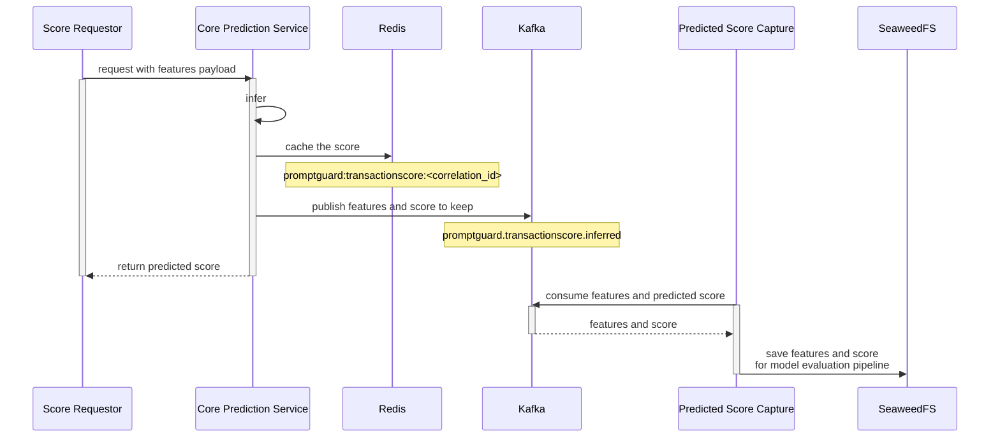
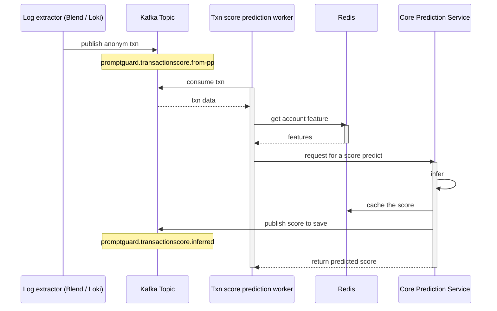
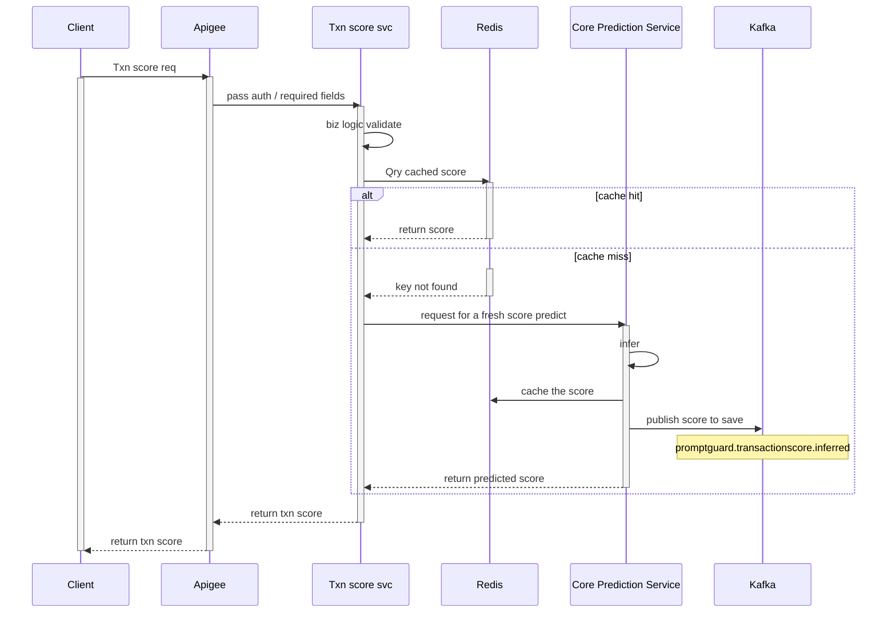

# Transaction risk score service


## Key components
There are 3 major components for the transaction risk score.  
* API services
    1.	On-demand API service (API for client)
    1.	Core Prediction service (internal API)
* Kafka consumer (worker)
    1.	Prediction worker (Kafka consumer)
---

# Service specification
> ℹ️ Both API services are gRPC API servers.

## Core prediction service (Python API)
* Python based model serving via API
* Receive only non-PII inputs
* This core service is served for the other 2 modules: Kafka consumer (worker) and API server.
* The inferred result will be output to 3 destinations: caching in Redis, producing to Kafka, and return to the requester.
* The input features and their predicted result, produced to Kafka, are kept in SeaweedFS, for model evaluation pipeline.

Here is its flow:


To evaluate prediction performance later, we need a predicted transaction ID that can be matched with CFR. It is called `correlation_id`.
Here is how we construct the `correlation_id` (python example):

```python
def construct_correlation_id(
    sender_proxy_id: str,
    receiver_proxy_id: str,
    timestamp: str,
    amount: str,
    sender_fi_code: Optional[str] = None,
    receiver_fi_code: Optional[str] = None,
    sender_proxy_type: str = 'account',
    receiver_proxy_type: str = 'account',
) -> str:
    """
    Constructs a short, unique correlation ID for a transaction.
 
    Args:
        sender_proxy_id: The sender's proxy ID (e.g., account number, phone).
        receiver_proxy_id: The receiver's proxy ID.
        timestamp: ISO 8601 formatted timestamp of the transaction.
        amount: The transaction amount in B.SS format (e.g., 100.50, 27.00).
        sender_fi_code: The sender's financial institution code. Required if proxy type is 'account'.
        receiver_fi_code: The receiver's financial institution code. Required if proxy type is 'account'.
        sender_proxy_type: The type of the sender's proxy.
        receiver_proxy_type: The type of the receiver's proxy.
 
    Returns:
        A 18-character hexadecimal correlation ID.
 
    Raises:
        ValueError: If an FI code is missing for an 'account' proxy type.
    """
    if (sender_proxy_type == 'account' and not sender_fi_code) or \
       (receiver_proxy_type == 'account' and not receiver_fi_code):
        raise ValueError("Financial institution code is required for 'account' proxy types.")
 
    if sender_proxy_type == 'account':
        sender_account_number = sender_proxy_id
    else:
        sender_fi_code, sender_account_number = proxy_resolve(sender_proxy_id, sender_proxy_type)
 
    if receiver_proxy_type == 'account':
        receiver_account_number = receiver_proxy_id
    else:
        receiver_fi_code, receiver_account_number = proxy_resolve(receiver_proxy_id, receiver_proxy_type)
 
    # Securely hash the account numbers with the secret
    sender_account_hash = hash_with_secret(sender_account_number, HASHING_SECRET)
    receiver_account_hash = hash_with_secret(receiver_account_number, HASHING_SECRET)
 
    combined_string = "|".join([
        str(sender_fi_code), sender_account_hash,
        str(receiver_fi_code), receiver_account_hash,
        str(timestamp), str(amount)
    ])
 
    hasher = hashlib.sha256(combined_string.encode('utf-8'))
    # Take the first 18 characters from the hexadecimal representation of the hash.
    correlation_id = hasher.hexdigest()[:18]
 
    return correlation_id
```

The 18-characters length is to avoid id collision for 6000 to 8000 million transactions which are kept for 3 months.	

## Kafka consumer (Go worker)
This worker consumes non-PII PromptPay messages from Kafka, prepares relevant features, then feeds to the Core prediction service




* The worker is scaled to handle amount of work load (messages) from Kafka topic.
* The feature materials will be got from Redis. They are prepared by [real-time transaction data preparation module](#prediction-features) beforehand.
* The worker will compose required features then feed to [Core prediction service](#core-prediction-service-python-api)


## On-demand transaction score service (Go API)
This module will be called by API gateway to serve transaction score on-demand. 



* In case that `/txn-score/svc/qry` cannot get any predicted score in Redis, it needs to anonymize PII data before calling the `/txn-score/predict/infer`. The salt (password to set in the hashing algorithm) must be configurable via k8s secret.
* This headless API service must be fast and lean. Golang is expected to be used.

---

# API specification
Below is the overview of the API spec.

*HTTP Header:*

| Header name   | Description |
|---------------|-------------|
| X-API-Version | v1          |
  
*API Services:*  

| Module                          | API                       | Version | Method | Description                                                                 |
|---------------------------------|---------------------------|---------|--------|-----------------------------------------------------------------------------|
| Transaction score service       | /txn-score/svc/health     | v1      | GET    | Service health check                                                        |
|                                 | /txn-score/svc/qry        | v1      | POST   | For client to query a predicted score                                       |
| Core transaction score prediction | /txn-score/predict/health | v1      | GET    | Service health check                                                        |
|                                 | /txn-score/predict/infer  | v1      | POST   | For internal score inference. An on-demand based score calculation used if there is no cached score available |

For more detail of the API see OpenAPI spec: [promptguard-txn-score-api-spec-v0.2.yaml](../../../openapi/promptguard-txn-score-api-spec-v0.2.yaml)  
Interface Protobuf: [promptguard-txn-score-v0.1.proto](../../../proto/itmx/promptguard/v1/promptguard-txn-score.proto)

---

# Redis schema

Key naming convention: see: [Key naming convention](../common-components/redis.md#key-naming-convention)

Example:
`promptguard:transactionscore:95248989ec91f6d043`

Value Data schema:
```json
{
  "correlation_id": "95248989ec91f6d043",
  "pp_txn_id": "202408132300010042024081323000180",
  "risk_score": 23,
  "timestamp": "2024-05-13T09:45:33+07:00"
}
```
|     Field    |     Occurence    |     Data type    |     Length / Range    |     Description    |
|---|---|---|---|---|
|     correlation_id    |     [1..1]    |     string    |     Max: 20    |     PromptGuard correlation ID in 18 lower-case hex characters    |
|     pp_txn_id    |     [1..1]    |     string    |     Max: 50    |     PromptPay transaction ID. Detail as below   |
|     risk_score    |     [1..1]    |     integer    |     0 to 100    |     Infered   transaction risk score. Higher score means more risk.    |
|     timestamp    |     [1..1]    |     string    |     25    |     Format: ISO-8601 datetime     Pattern: YYYY-MM-DDThh:mm:ssZ    |

PromptPay transaction ID is from account lookup message. It is different for ISO8583 and ISO20022.  
For ISO8583, it is a concat string of: `TSTAMP_LOCAL`+`INST_ID_RECON_ACQ`+`RETRIEVAL_REF_NO`+`TRAN_CLASS`.  
For ISO20022, it is `RETRIEVAL_REF_NO`.  

---

# Kafka topic and message schema
Naming: see: [Topic naming convention](../common-components/kafka.md#topic-naming-convention)

Here are the Kafka topics used in this module:

* `promptguard.transactionscore.from-pp`
This topic keeps anonymized transactions streaming from PromptPay in real-time.

* `promptguard.transactionscore.infered`
This topic keeps inferred score from Core Prediction Service. There will be a scheduled consumer save this score to SeaweedFS for the evaluation pipeline.

## PromptPay message schema
This is expected message schema of `promptguard.transactionscore.from-pp`:

<!-- // TODO: expected PP message schema -->
|     Field    |     Occurence    |     Data type    |     Length    |     Description    | Example |
|---|:---:|:---:|:---:|---|---|
| ACCT_1_ID | [1..1] | string | 40 | Sender account number | d7KW4uuNmV+Li9hbecdLz8MYEQpfcdrHgj5UnNk3DsU= |
| ACCT_1_NAME | [1..1] | string | 150 | Sender account name | mXFKL6pisfDLOKIGBMRVHMz84kudzSS7ETulJIqbLEY= |
| ACCT_2_ID | [1..1] | string | 40 |  Receiver account number | 6Z1RaS0p9GcjFRV0nLIyvDmNhkvTqGqQwcaNw/rJQ4o= |
| ACCT_2_NAME | [1..1] | string | 150 | Receiver account name | udWoJ/3DUAkc8zZClxFvGU6H/3IqPZDwOccrmE7WeiLBe1hQS6ef9rgAu9L1THKG/G/+0ZOJfjppLiCwGFw7Aw== |
| ACT_CODE | [1..1] | string | 3 | Status code: accept = 000  | 000 |
| AMT_RECON_NET | [1..1] | string | 18 | unit: satang | +000000000000002400. |
| BILL_REF1 | [1..1] | string | 20 |  |  |
| BILL_REF2 | [1..1] | string | 20 |  |  |
| BILL_REF3 | [1..1] | string | 20 |  |  |
| FROM_ISO | [1..1] | string | Max: 5 | Original PP message schema.<br>8583 or 20022 | 20022 |
| INST_ID_RECON_ACQ | [1..1] | string | 3 | sender BANK_CODE | 004 |
| INST_ID_RECON_ISS | [1..1] | string | 3 | receiver BANK_CODE | 014 |
| RECV_PROXY_ID | [1..1] | string | 128 |  | 010753600031508 |
| RECV_PROXY_TYPE  | [1..1] | string | 12 |  | BILLERID |
| RECV_TYPE | [1..1] | string | 1 |  | H |
| RETRIEVAL_REF_NO | [1..1] | string | 12 | ~RRN - internal transaction id (same ID for all 4-leg of pp transactions) | 155959 |
| SEND_TYPE | [1..1] | string | 1 |  | H |
| TERM_CLASS | [1..1] | string | 2 | User access channel<br>see the mapping table below. | 80 |
| TRAN_CLASS | [1..1] | string | 3 | transcation: CTF (credit transfer) | BPA |
| TSTAMP_LOCAL | [0..1] | string | 14 | Time at user application in GMT+7.<br>Optional field, avaliable only in ISO8583 | 20240813230001 |
| TSTAMP_TRANS | [1..1] | string | 14 to 16 | Tranmission date time to ITMX (Original message in GMT).<br>Should be the same as `TSTAMP_LOCAL`. <br> Legth 16 for 8583 and 14 for 20022.| 2024081323000100 <br> 20240401000049 |

TERM_CLASS | Channel |
|:---:|---|
| 10 | IVR |
| 20 | Kiosk |
| 30 | ATM |
| 40 | EDC/POS |
| 50 | Counter |
| 60 | Internet |
| 70 | CDM |
| 80 | Mobile |

## Predicted score and its features schema
This is expected message schema of `promptguard.transactionscore.infered`:
```json
{
  "correlation_id": "95248989ec91f6d043",
  "pp_txn_id": "202408132300010042024081323000180",
  "risk_score": 23,
  "timestamp": "2024-05-13T09:45:33+07:00",
  "features": {
    <FEATURE_DATA>
  }
}
```
The [Predicted Score Capture](../data-prep.md#predicted-score-capture) worker will consume this data and save to SeaweedFS for the evaluation pipeline.

# Prediction Features
There are 2 kinds of prediction features used, near real-time and daily features.  
For more detail see: [Prediction Feature Updater](../data-prep.md#prediction-feature-updater)